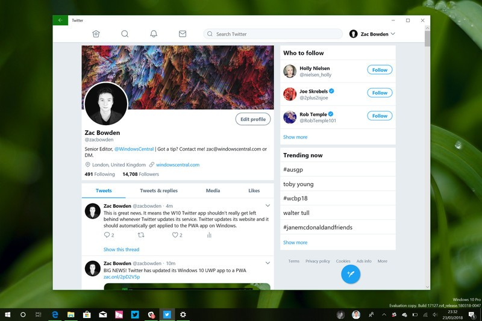
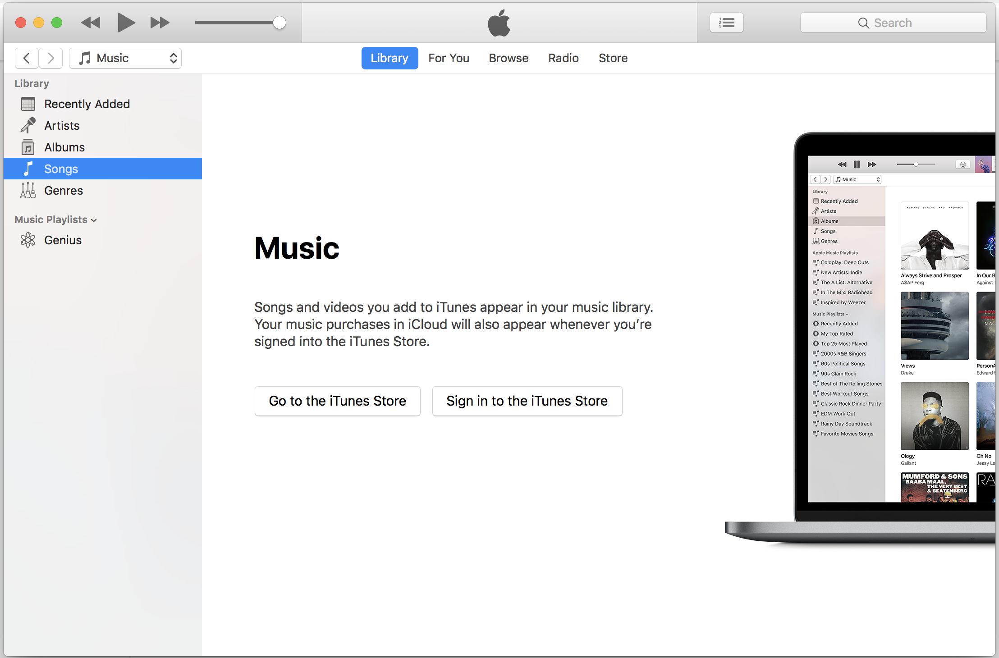
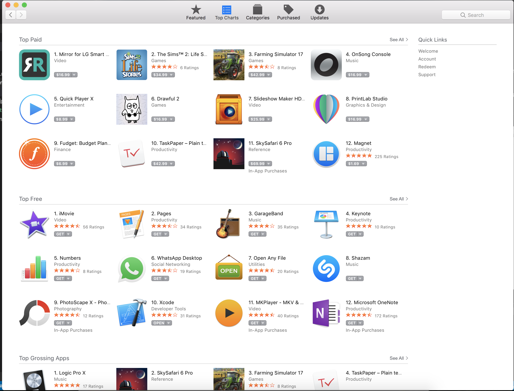
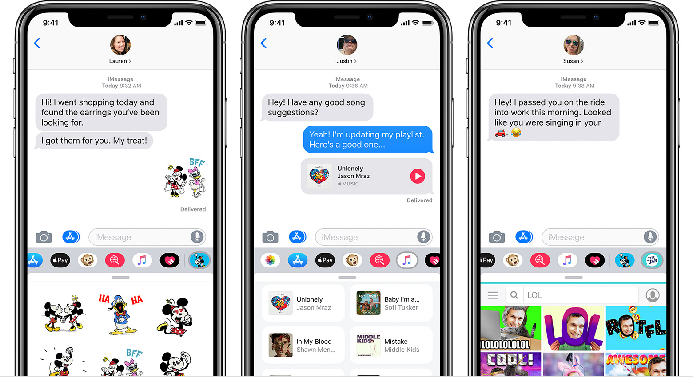

# Back Button Media Query Explainer

Author: Jay Harris <harrisjay@chromium.org>

Date: 2019-01-23

Note: This explainer is based on [mgiuca's](https://github.com/mgiuca) proposal on [w3c/manifest#693](https://github.com/w3c/manifest/issues/693).

## Overview

The **back button media query** is a proposed API (as defined by the [Web App Manifest Standard](https://www.w3.org/TR/appmanifest/)) to determine whether a back button is currently being shown.

This API is being proposed as a way to eliminate the "double back button" problem (seen [here](images/double-back-button.jpg), on Twitters PWA in the Microsoft store). This problem arises because developers of ["standalone" and "minimal-ui"](https://www.w3.org/TR/appmanifest/#display-modes), apps have no way of determining whether a back button will be provided by the user agent (in the browser, OS or hardware), and so, are forced to implement their own, to ensure users are still able to use the app.

This will allow apps to avoid the "double back button" problem by letting them conditionally display a back button depending on whether the user agent is already displaying one. Adding a standard way to detect this means that we can avoid user-agent and viewport-size workarounds, which are not ideal for Web Compatibility.

Possible Areas of Expansion
- Detection of other controls, such as a forward button or tab strip

Examples of sites that may use the API
- Twitter (currently they are using user-agent detection to determine whether to show a back button).
- Any app that performs navigations.

Advantages over user-agent detection
- If the user agent changes whether a display-mode displays a back button the site will not have to be updated.
- Sites don't have to understand how different user-agents will render them on different devices in different display-modes. For example, PWAs on Edge display a back button if there are pages in history while PWAs in Chrome never show a back button and PWAs on Android always have a back button available.

## API Proposal

A CSS Media query `navigation-controls` which determines what navigation controls are currently available, with the possible values `'none'` | `'back'` with the possibility of being extended with `'back-and-forward'` in future. However, the API is designed to be used in a [boolean context](https://www.w3.org/TR/mediaqueries-4/#mq-boolean-context), so all future values should imply the presence of a back button (e.g. we wouldn't add a `'forward'` value).

*Note: This value is an enum not a boolean because `<mq-boolean>` is intended for [legacy purposes only](https://www.w3.org/TR/mediaqueries-4/#grid), with the spec noting that "If this feature were being designed today, it would instead use proper named keywords for its values."*

There is precedence for doing feature detection via a CSS media query in the web app manifest's [display mode](https://www.w3.org/TR/appmanifest/#the-display-mode-media-feature), which allows developers to determine how their app is being displayed.

The `navigation-controls` query should always be available, including when the app is not in a standalone window (i.e. it is in a normal browser window). In such a scenario, it should have an appropriate value, likely `'back'`. This has the added advantage that querying `navigation-controls` should be a necessary and sufficient condition for displaying the back button, there would be no need to also query `display-mode`.

### CSS

It is expected that for the majority of use cases, simple CSS detection should be sufficient. This has the added advantage that it will work even if JavaScript is not enabled on the page (though it is unlikely that much else in a modern web application will).

```css
@media navigation-controls {
    #back-button {
        display-none;
    }
}
```

### JavaScript
In more complicated scenarios, it might be more useful to detect the presence of the back button in JavaScript. Fortunately there is already a mechanism for running media queries in JavaScript.

```js
const backButtonQuery = window.matchMedia('navigation-controls');
backButtonQuery.addEventListener(query => {
    const backButton = window.getElementById('back-button');
    if (query.matches) {
        myFancyAnimateBackButtonIn(backButton);
    } else {
        myFancyAnimateBackButtonOut(backButton);
    }
});
```

*Note: It is not enough to simply check for the presence of a back button once, you must add the event listener to the media query, as it is  possible for the back button to be dynamically added and removed by the user agent. For example, in Chrome, an app can be moved into a tab and out again into an app window.*

## Specific Operating System Treatment

In general, operating systems go one of two ways:

1. The system is expected to provide a back button, when required (e.g. Window 10, where a back button is added to PWAs when there is history).
2. There is no 'system' back button, applications are always responsible for adding their own back button (e.g. iOS)

### Not Android
On non-Android platforms, there is no hardware/os level button, so the decision to show or hide a back button can be made on a per user-agent per platform level and reported via the query. Below are some recommendations.

- Windows 10: Display a user-agent back button when history is available. This is consistent with existing applications from the Microsoft store. *Note: There may be a quirk here if the value of `navigation-controls` changes one Windows 10 when there is no history.* 
- Mac OS: Unclear what the OS conventions are but iTunes displays its buttons outside of the title bar.  while the App Store always displays its buttons but inside the title bar. 
- iOS: Don't display a user-agent back button. iOS applications are generally responsible for drawing their own navigation buttons. 
- Linux: Unclear what conventions are.
- ChromeOS: Unclear what conventions are.

### Android
Most platforms provide either a system back button (e.g. Windows 10), or expect applications to provide their own (e.g. iOS). Android is somewhat unique in that it provides a system back button but still expects applications to display their own. In the Android case 

## Questions and Concerns

### Why isn't this a JavaScript API?

### Why can't I just say in my manifest whether I want a back button?

### Can I tell what kind of button is being displayed (i.e. hardware or software)?